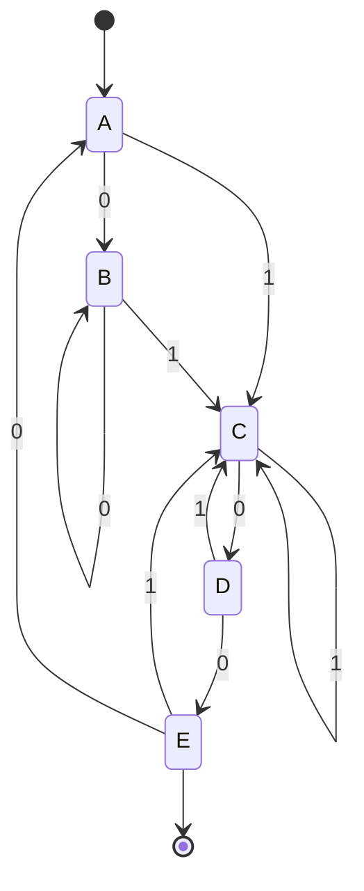
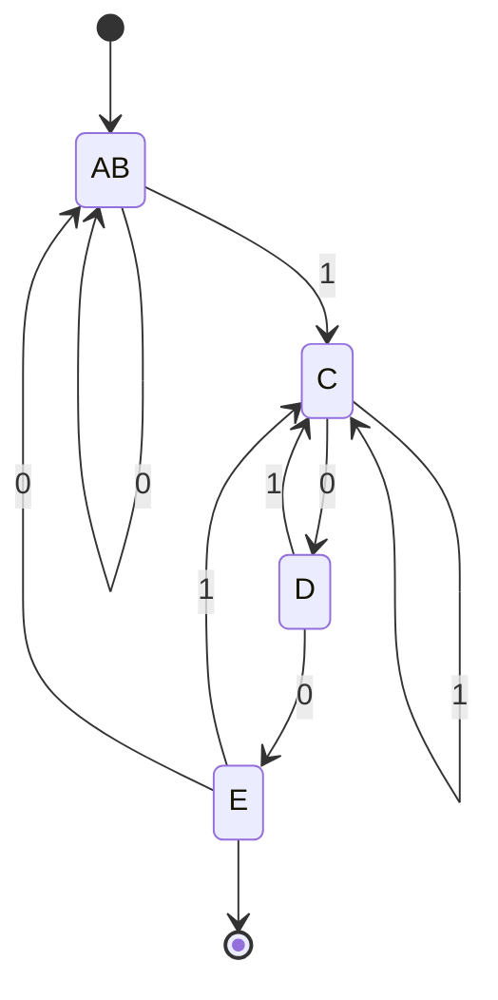

## Introduction

Myhill-Nerode theorem is a powerful tool that can be used to prove that a language is regular, furthermore it helps in building an algorithm that can be used to minimise a DFA(Deterministic Finite Automata).

Let there be two strings $x$ and $y$, and a language $L$. The strings $x$ and $y$ are said to be Nerode congruent or related by $\sim_L$ if there doesn't exist any string $z$ that we can concatenate at the end of these such that one ends up in $L$ and one doesn't i.e. mathematically:
$$x \sim_L y \iff \forall z \ (xz \in L \iff yz \in L)$$

$\sim_L$ is an equivalent relation that partition all strings into equivalence classes.

> Myhill-Nerode theorem states that $\sim_L$ has finite number of equivalence classes(say $k$) iff language $L$ is regular. Furthermore the number of states in minimised DFA is equal to $k$.
{: .callout-info}

The reasoning behind the theorem can be illustrated in the following way:  
We know that a language is regular if a DFA can be constructed which accepts every string present in the string and rejects otherwise. In DFA, only the current state matters and the path by which it was achieved doesn't so if strings $x$ and $y$ are at the same state, then $x \sim_L y$ and there is finite number of states in DFA so are the number of equivalent classes.

## Minimisation of DFA

### Algorithm

1. Create a lower triangular table to pair every state with every another state. A lower triangular table is sufficient as they are reflexive.
2. For each pair ($S_i$,$S_j$), mark it if exactly one of them is final state.
3. For each unmarked pair ($S_i$,$S_j$), mark it if pair ($\delta(S_i,x),\delta(S_j,x)$) is marked where $\delta$ is transition from one state to another on input $x$ where $x\in \Sigma$.
4. Repeat Step 3 until no further changes occur.
5. Merge all the unmarked pairs. The resulting DFA is the minimised DFA.

### Example

**Step 2:**  
The pairs that should be marked are $(A,E),(B,E),(C,E),(D,E)$

|   | A | B | C | D | E |
|---|---|---|---|---|---|
| A |   |   |   |   |   |
| B |   |   |   |   |   |
| C |   |   |   |   |   |
| D |   |   |   |   |   |
| E | ✓ | ✓ | ✓ | ✓ |   |

**Step 3:**

For pair $(A,B)$:  
$(\delta(A,0),\delta(B,0))=(B,B)$ and $(\delta(A,1),\delta(B,1))=(C,C)$

For pair $(A,C)$:  
$(\delta(A,0),\delta(C,0))=(B,D)$ and $(\delta(A,1),\delta(C,1))=(C,C)$

For pair $(A,D)$:  
$(\delta(A,0),\delta(D,0))=(B,E)$ and $(\delta(A,1),\delta(D,1))=(C,C)$

For pair $(B,C)$:  
$(\delta(B,0),\delta(C,0))=(B,D)$ and $(\delta(B,1),\delta(C,1))=(C,C)$

For pair $(B,D)$:  
$(\delta(B,0),\delta(D,0))=(B,E)$ and $(\delta(B,1),\delta(D,1))=(C,C)$

For pair $(C,D)$:  
$(\delta(C,0),\delta(D,0))=(D,E)$ and $(\delta(C,1),\delta(D,1))=(C,C)$

So now pairs $(A,D),(B,D),(C,D)$ will be marked.

|   | A | B | C | D | E |
|---|---|---|---|---|---|
| A |   |   |   |   |   |
| B |   |   |   |   |   |
| C |   |   |   |   |   |
| D | ✓ | ✓ | ✓ |   |   |
| E | ✓ | ✓ | ✓ | ✓ |   |

Now pairs $(A,C),(B,C)$ will be marked.

|   | A | B | C | D | E |
|---|---|---|---|---|---|
| A |   |   |   |   |   |
| B |   |   |   |   |   |
| C | ✓ | ✓ |   |   |   |
| D | ✓ | ✓ | ✓ |   |   |
| E | ✓ | ✓ | ✓ | ✓ |   |

**Step 5:**  
The remaining unmarked pair is $(A,B)$, so states $A$ and $B$ will merge to a new state $AB$.

### Intuition

Insights into how this algorithm works and its connection to the Myhill-Nerode theorem can be developed by considering the following:  
Let there be a language $L$ = Set of strings with odd number of $a$s and no $c$s over $\Sigma=\{a,b,c\}$.  
Say $w\in L$ and $w=xz$ then the equivalent classes will be:

| $x$ | $z$ |
|---|---|
| $\varepsilon$, $b$, $aa$, $\cdots$ Strings with even number of $a$s and no $c$s | Strings with an odd numbers of $a$s and no $c$s |
| $a$, $ab$, $\cdots$ Strings with odd number of $a$s and no $c$s | Strings with an even number of $a$s and no $c$s |
| $c$, Strings containing $c$ | $\emptyset$ |

and now a DFA can be constructed having $3$ states which accepts this language and it will be having minimal states.

In the example, the unmarked pairs $(A,B)$, obtained after recursively marking pairs belong to the same equivalence class, so we could merge them.  
Ultimately, the algorithm identifies distinguishable extensions ($z$). For instance, at Step $2$, for $x = \varepsilon$, we find that pair $(A,E)$ is distinguishable because one state accepts it (state $E$) while the other does not (state $A$). At each iteration of Step $3$, distinctions propagate by analyzing transitions on every input symbol. If even one distinguishing extension exists for two states, they cannot be equivalent.