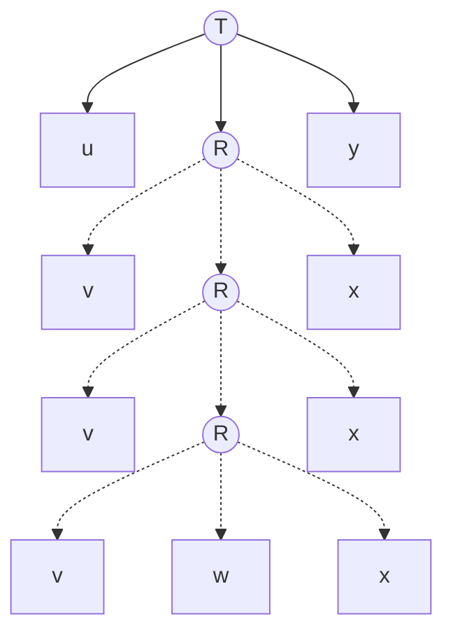

## Introduction

Pumping Lemma for CFL describes an essential characteristic of context-free languages. It says that a string with sufficiently long length belonging to a language that is context-free can be divided into five sections, then the string obtained by pumping (or repeating) the second and fourth sections also belongs to the same language.

> **Pumping Lemma for context-free languages:** It states that for a given context-free language $L$, there exists an integer $p \ge 1$ such that for every string $s$ having $\lvert s \rvert \ge p$ can be expressed as $s=uvwxy$ and the following conditions hold:
>
> $$\lvert vx \rvert \ge 1$$
> $$\lvert vwx \rvert \le p$$
> $$(\forall n \ge 0) (uv^nwx^ny \in L)$$
>
> Mathematically:
>
>  $$
        \forall L \subseteq \Sigma^*, \text{context-free}(L) 
        $$
        $$
        \implies  \exists p \geq 1, \forall s \in L, \mid s\mid  \geq p 
        $$
        $$
        \implies  \exists u, v, w, x, y \in \Sigma^*,
        $$
        $$
        (s = uvwxy) \land (\mid vx\mid  \geq 1) \land (\mid vwx\mid  \leq p) \land (\forall n \geq 0, uv^nwx^ny \in L)
        $$
{: .callout-info}

We can get intuitions behind this lemma by considering a parse tree of a sufficiently long string $s$ that belongs to context-free language $L$ and let $G$ be the context-free grammar that generates $L$. As $s \in L$, it can be derived from grammar $G$. As the string $s$ is of sufficiently long length ($\lvert s \rvert \ge p$), and the number of non-terminal symbols in the grammar is finite, there must be some non-terminal symbol $R$ that appears more than once according to pigeonhole principle.

We can repeat this $R$ to pump the string and as a result pump $v$ and $x$ in the string $s$ to obtain $s'=uv^iwx^iy$ where $i \ge 0$ which also belongs to the same language $L$.

## Application

Pumping lemma can be used to prove that a language is non context-free by "Proof by Contradiction". We assume that the language is context-free and choose a string whose length is greater than the pumping constant and that can't be pumped and we reach a contradiction by failing to divide the string into any $u,v,w,x,y$ and then put forward that the language is non context-free.

It is important to note that the converse of pumping lemma is not true i.e. a language that satisfies these conditions is not necessarily a context-free language.

### Example 1

> **Claim:** The language $L=\{a^nb^nc^n \mid n \ge 0\}$ is not context-free.
{: .callout-question}

**Proof:** Let us assume $L$ to be a CFL. Now according to pumping lemma $\exists (p \ge 1)$.
Let the string $s \in L$ and $s=a^pb^pc^p$. Then $\lvert s \rvert=3p>p$ and $s=uvwxy$.
Two cases arise:

**Case 1:** $v$ and $x$ each contains only one type of symbol.
Now by statement 3 of lemma, $s'=uv^2wx^2y \in L$ but $s'$ doesn't contain equal number of $a$'s, $b$'s and $c$'s so $s' \notin L$. A contradiction.

**Case 2:** $v$ and $x$ each contains two types of symbols.
Now by statement 3 of lemma, $s'=uv^2wx^2y \in L$ but in $s'$ the symbols are not in correct order and are intermixed so $s' \notin L$. A contradiction.

Hence, the initial assumption was wrong and the language $L$ is not context-free.

### Example 2

> **Claim:** The language $L=\{a^ib^jc^k \mid 0 \le i \le j \le k\}$ is not context-free.
{: .callout-question}

**Proof:** Let us assume $L$ to be a CFL. Now according to pumping lemma $\exists (p \ge 1)$.
Let the string $s \in L$ and $s=a^pb^pc^p$. Then $\lvert s \rvert=3p>p$ and $s=uvwxy$.
Two cases arise:

**Case 1:** $v$ and $x$ each contains only one type of symbol.
Now 3 further cases arise:
*   **Case 1a:** $a$'s don't appear: In this case, pumping up won't help as number of $b$'s and $c$'s can be more than the number of $a$'s. So we have to pump down to reach a contradiction. By statement 3 of lemma $s'=uv^0wx^0y \in L$ but it contains same number of $a$'s as $s$ but lesser $b$'s and $c$'s so $s' \notin L$. A contradiction.
*   **Case 1b:** $b$'s don't appear: $v$ and $x$ contains $a$'s or $c$'s. For $a$'s, if we pump up the $s$ then by statement 3 of lemma $s_1'=uv^2wx^2y \in L$ but it contains more number of $a$'s than $b$'s so $s_1' \notin L$. A contradiction. For $c$'s, if we pump down the $s$ then by statement 3 of lemma $s_2'=uv^0wx^0y \in L$ but it contains less number of $c$'s than $b$'s so $s_2' \notin L$. A contradiction.
*   **Case 1c:** $c$'s don't appear: By statement 3 of lemma $s'=uv^2wx^2y \in L$ but it contains more number of $a$'s or $b$'s than $c$'s so $s' \notin L$. A contradiction.

**Case 2:** $v$ and $x$ each contains two types of symbols.
Now by statement 3 of lemma, $s'=uv^2wx^2y \in L$ but in $s'$ the symbols are not in correct order and are intermixed so $s' \notin L$. A contradiction.

Hence, the initial assumption was wrong and the language $L$ is not context-free.

### Example 3

> **Claim:** The language $L=\{ww \mid w \in \{0,1\}^*\}$ is not context-free.
{: .callout-question}

**Proof:** Let us assume $L$ to be a CFL. Now according to pumping lemma $\exists (p \ge 1)$.
Let the string $s \in L$ and $s=0^p1^p0^p1^p$. Then $\lvert s \rvert=4p>p$ and $s=uvwxy$.
By condition 2 of the pumping lemma, $\lvert vwx \rvert \le p$.

3 cases arise:

**Case 1:** We chose $vwx$ in the first half of $s$: By statement 3 of lemma, $s'=uv^2wx^2y \in L$ but now the first symbol of second half becomes $1$ but the first symbol of first half is still $0$. So $s' \notin L$. A contradiction.

**Case 2:** We chose $vwx$ in the second half of $s$: By statement 3 of lemma, $s'=uv^2wx^2y \in L$ but now the last symbol of first half becomes $0$ but the last symbol of second half is still $1$. So $s' \notin L$. A contradiction.

**Case 3:** We chose $vwx$ ranging over both first half and second half of $s$: By statement 3 of lemma, $s'=uv^0wx^0y \in L$ but $s'=0^p1^i0^j1^p$ where $(i < p \lor j < p)$ so $s' \notin L$. A contradiction.

Hence, the initial assumption was wrong and the language $L$ is not context-free.

### Example 4

> **Claim:** The language $L=\{0^n\text{\#}0^{2n}\text{\#}0^{3n} \mid n \ge 0\}$ is not context-free.
{: .callout-question}

**Proof:** Let us assume $L$ to be a CFL. Now according to pumping lemma $\exists (p \ge 1)$.
Let the string $s \in L$ and $s=0^p\text{\#}0^{2p}\text{\#}0^{3p}$. Then $\lvert s \rvert=6p+2>p$ and $s=uvwxy$.
By condition 2 of the pumping lemma, $\lvert vwx \rvert \le p$.

2 cases arise:

**Case 1:** $v$ contains \text{\#} or $x$ contains \text{\#}.
Now by statement 3 of lemma, $s'=uv^2wx^2y \in L$ but $s'$ contains more than two \text{\#}s so $s' \notin L$. A contradiction.

**Case 2:** $v$ doesn't contains \text{\#} and $x$ doesn't contains \text{\#}. So $vwx$ ranges over segments $0^p$ or $0^{2p}$ or $0^{3p}$.
Now by statement 3 of lemma, $s'=uv^2wx^2y \in L$ but in $s'$ the $0$'s are not in ratio $1:2:3$ so $s' \notin L$. A contradiction.

Hence, the initial assumption was wrong and the language $L$ is not context-free.

### Example 5

> **Claim:** The language $L=\{w\text{\#}t \mid w \text{ is a substring of } t \text{ where } w, t \in \{a, b\}^*\}$ is not context-free.
{: .callout-question}

**Proof:** Let us assume $L$ to be a CFL. Now according to pumping lemma $\exists (p \ge 1)$.
Let the string $s \in L$ and $s=a^pb^p\text{\#}a^pb^p$. Then $\lvert s \rvert=4p+1>p$ and $s=uvwxy$.
By condition 2 of the pumping lemma, $\lvert vwx \rvert \le p$.

4 cases arise:

**Case 1:** $v$ contains \text{\#} or $x$ contains \text{\#}.
Now by statement 3 of lemma, $s'=uv^2wx^2y \in L$ but $s'$ contains more than one \text{\#}s so $s' \notin L$. A contradiction.

**Case 2:** $vwx$ lies on left of \text{\#}. By statement 3 of lemma, $s'=uv^2wx^2y \in L$ but in $s'$ the left of \text{\#} is longer and hence it can't be a substring so $s' \notin L$. A contradiction.

**Case 3:** $vwx$ lies on right of \text{\#}. By statement 3 of lemma, $s'=uv^0wx^0y \in L$ but in $s'$ the left of \text{\#} is longer and hence it can't be a substring so $s' \notin L$. A contradiction.

**Case 4:** $v$ doesn't contains \text{\#} and $x$ doesn't contains \text{\#} and $vwx=b^i\text{\#}a^j$ where $i < p \land j < p \land (i+j \ge p-1)$. Now by statement 3 of lemma, $s'=uv^2wx^2y \in L$ but in $s'$ the left of \text{\#} contains more number of $b$'s and hence it can't be a substring so $s' \notin L$. A contradiction.

Hence, the initial assumption was wrong and the language $L$ is not context-free.

### Example 6

> **Claim:** The language $L=\{0^n1^n0^n1^n \mid n \ge 0\}$ is not context-free.
{: .callout-question}

**Proof:** Let us assume $L$ to be a CFL. Now according to pumping lemma $\exists (p \ge 1)$.
Let the string $s \in L$ and $s=0^p1^p0^p1^p$. Then $\lvert s \rvert=4p>p$ and $s=uvwxy$.
By condition 2 of the pumping lemma, $\lvert vwx \rvert \le p$.

2 cases arise:

**Case 1:** $v$ and $x$ each contains only one type of symbol.
Now by statement 3 of lemma, $s'=uv^2wx^2y \in L$ but $s'$ doesn't contain equal number of $0$'s and $1$'s in ratio $1:1:1:1$ so $s' \notin L$. A contradiction.

**Case 2:** $v$ and $x$ each contains two types of symbols.
Now by statement 3 of lemma, $s'=uv^2wx^2y \in L$ but in $s'$ the symbols are not in correct order and are intermixed so $s' \notin L$. A contradiction.

Hence, the initial assumption was wrong and the language $L$ is not context-free.

## References

1. Michael Sipser, *Introduction to the Theory of Computation*, Cengage Learning, 2012.
2. Wikipedia contributors, *Pumping lemma for context-free languages --- Wikipedia, The Free Encyclopedia*, 2025, [https://en.wikipedia.org/wiki/Pumping_lemma_for_context-free_languages](https://en.wikipedia.org/wiki/Pumping_lemma_for_context-free_languages)
