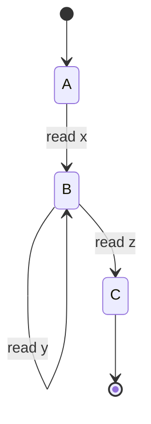

## Introduction

Pumping Lemma describes an essential characteristic of regular languages. It says that a sufficiently long string belonging to a regular language can be divided into three parts, and the string obtained by pumping (repeating) the middle part also belongs to the same language.

> **Pumping Lemma:** For a regular language $L$, there exists an integer $p \ge 1$ such that every string $w$ with $\lvert w \rvert \ge p$ can be written as $w = xyz$, and the following conditions hold:
>
> $$\lvert y \rvert \ge 1$$
> $$\lvert xy \rvert \le p$$
> $$(\forall n \ge 0)\; xy^n z \in L$$
>
> Mathematically:
>
> $$\forall L \subseteq \Sigma^*,\; \text{regular}(L) \implies \exists p \ge 1,\; \forall w \in L,\; \lvert w \rvert \ge p$$
>
> $$\implies \exists x,y,z \in \Sigma^*,\; (w = xyz) \land (\lvert y \rvert \ge 1) \land (\lvert xy \rvert \le p) \land (\forall n \ge 0,\; xy^n z \in L)$$
{: .callout-info}

We can build intuition behind this lemma using a DFA that accepts regular language $L$. Let $w \in L$ and $\lvert w \rvert = n \ge p$. As $w$ is accepted, its path ends in a final state. Since each character induces one transition, $n$ characters give $n$ transitions and thus $n+1$ visited states. Because $n+1 > p$, the pigeonhole principle guarantees some state is repeated.

Now split $w$ into $x,y,z$:

- $x$: before the first visit to repeated state $B$
- $y$: from first visit to second visit of $B$ (the loop)
- $z$: remaining suffix

Then:

- $\lvert y \rvert \ge 1$ because a non-empty loop is traversed
- $\lvert xy \rvert \le p$ because repetition occurs within first $p+1$ states
- Pumping $y$ keeps the computation valid, so $xy^n z \in L$ for all $n \ge 0$

## Proof

**Proof:** Let $D=(Q,\Sigma,\delta,q_0,F)$ be a DFA accepting $L$, and let $p=\lvert Q \rvert$.
Take any $w=w_1w_2\cdots w_n \in L$ with $n \ge p$.
Let the state sequence while reading $w$ be $r_1,r_2,\dots,r_{n+1}$ where

$$r_{i+1}=\delta(r_i,w_i)\quad \forall i \in [1,n].$$

Among the first $p+1$ states, some state repeats (pigeonhole principle). Let first occurrence be at index $a$ and second at $b$ with $a<b\le p+1$.
Define:

$$x=w_1\cdots w_{a-1},\quad y=w_a\cdots w_{b-1},\quad z=w_b\cdots w_n.$$

For any $i\ge 0$, consider $w' = xy^iz$:

- $x$ moves DFA from $r_1$ to $r_a$
- $y$ moves DFA from $r_a$ back to $r_a$
- $z$ moves DFA from $r_a$ to final state $r_{n+1}$

Hence $w' \in L$ for all $i\ge 0$.
Also:

$$a\ne b \implies \lvert y \rvert > 0$$
$$b\le p+1 \implies b-1\le p \implies \lvert xy \rvert \le p$$

So all pumping-lemma conditions hold.

## Application

Pumping lemma is commonly used to prove that a language is **not** regular via contradiction:

1. Assume language $L$ is regular.
2. Let $p$ be pumping length.
3. Choose $w\in L$ with $\lvert w \rvert \ge p$.
4. Show no valid decomposition $w=xyz$ can satisfy pumping condition.
5. Contradiction implies $L$ is not regular.

It is important to note that the converse is not true: satisfying pumping-style conditions does not by itself guarantee regularity.

## Examples

### Example 1

> **Claim:** $L=\{0^n1^n \mid n\in \mathbb{N}\}$ is not regular.
{: .callout-question}

**Proof:** Assume $L$ is regular with pumping length $p$.
Pick $w=0^p1^p$ so $\lvert w \rvert =2p>p$.
For any split $w=xyz$ with $\lvert xy \rvert \le p$, substring $y$ contains only $0$s, say $y=0^k$ with $k\ge1$.
Pumping down ($n=0$):

$$xy^0z = 0^{p-k}1^p \notin L$$

because counts of $0$s and $1$s differ. Contradiction.

### Example 2

> **Claim:** $L=\{ss \mid s\in\{0,1\}^*\}$ is not regular.
{: .callout-question}

**Proof:** Assume $L$ regular with pumping length $p$.
Choose $w=0^p10^p1\in L$.
Any split with $\lvert xy \rvert \le p$ has $y=0^k$ for $k\ge1$.
Pump with $n=2$:

$$xy^2z = 0^{p+k}10^p1$$

The two halves are no longer equal, so $xy^2z\notin L$. Contradiction.

### Example 3

> **Claim:** $L=\{1^{n^2} \mid n\ge0\}$ is not regular.
{: .callout-question}

**Proof:** Assume $L$ regular with pumping length $p$.
Choose $w=1^{p^2}$.
Any split with $\lvert xy \rvert \le p$ has $y=1^k$, $1\le k\le p$.
Pump once more ($n=2$):

$$xy^2z = 1^{p^2+k}.$$

But there is no perfect square strictly between $p^2$ and $(p+1)^2$, and

$$p^2 < p^2+k < p^2+(2p+1)=(p+1)^2$$

since $1\le k\le p<2p+1$. So $xy^2z\notin L$. Contradiction.

### Example 4

> **Claim:** $L=\{0^i1^j \mid i>j\}$ is not regular.
{: .callout-question}

**Proof:** Assume $L$ regular with pumping length $p$.
Choose $w=0^p1^{p-1}\in L$.
Any valid split has $y=0^k$ with $k\ge1$.
Pump down ($n=0$):

$$xy^0z = 0^{p-k}1^{p-1}.$$

Now number of $0$s is at most $p-1$, not greater than number of $1$s. So $xy^0z\notin L$. Contradiction.

### Example 5

> **Claim:** $L=\{0^n1^n2^n \mid n\ge0\}$ is not regular.
{: .callout-question}

**Proof:** Assume $L$ regular with pumping length $p$.
Choose $w=0^p1^p2^p$.
Any split with $\lvert xy \rvert \le p$ gives $y=0^k$ for $k\ge1$.
Pump with $n=2$:

$$xy^2z = 0^{p+k}1^p2^p$$

which breaks equality of the three block lengths, so $xy^2z\notin L$. Contradiction.

### Example 6

> **Claim:** $L=\{sss \mid s\in\{0,1\}^*\}$ is not regular.
{: .callout-question}

**Proof:** Assume $L$ regular with pumping length $p$.
Choose $w=0^p10^p10^p1\in L$.
Any split with $\lvert xy \rvert \le p$ has $y=0^k$, $k\ge1$.
Pump with $n=2$:

$$xy^2z = 0^{p+k}10^p10^p1$$

which cannot be expressed as three equal consecutive copies. Contradiction.

### Example 7

> **Claim:** $L=\{1^{2^n} \mid n\ge0\}$ is not regular.
{: .callout-question}

**Proof:** Assume $L$ regular with pumping length $p$.
Choose $w=1^{2^p}$.
Any split with $\lvert xy \rvert \le p$ has $y=1^k$, $1\le k\le p$.
Pump with $n=2$:

$$xy^2z = 1^{2^p+k}.$$

Since $k>0$, we have $2^p < 2^p+k$, and since $k\le p<2^p$ (for $p\ge1$),

$$2^p+k < 2^p+2^p = 2^{p+1}.$$

No power of 2 lies strictly between $2^p$ and $2^{p+1}$, so $xy^2z\notin L$. Contradiction.

## References

1. Michael Sipser, *Introduction to the Theory of Computation*, Cengage Learning, 2012.
2. Wikipedia contributors, *Pumping lemma for regular languages*, 2024, <https://en.wikipedia.org/wiki/Pumping_lemma_for_regular_languages>
3. Stanford University, *CS103: Mathematical Foundations of Computing*, <https://web.stanford.edu/class/cs103/>
